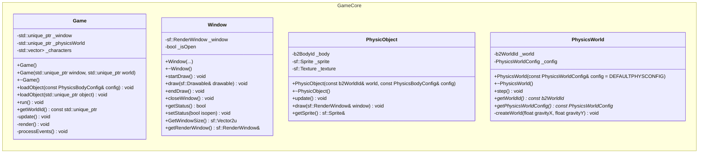

# SFML and Box2D playground
## Little Game
This repository is my space to explore the features of [SFML (Simple and Fast Multimedia Library)](https://www.sfml-dev.org/index.php), a library used for the development of games and multimedia applications, and [Box2D physics engine for games](https://box2d.org/documentation/index.html).


## Project Structure
Below is an overview of the project's directory structure. The project is currently ongoing, and this information will be updated as development progresses.  

```css
sfml-playground/
│
├── build/                      # Build output dir will be created via CMake
│   ├── _deps/                  # External dependencies: SFML, Box2D
│   ├── ...                     # Any build-related files
│   └── bin/main                # Compiled executable
│
├── include/                    # Header files
│   ├── game.hpp 
│   ├── ... 
│   └── window.hpp          
│
├── src/                        # Source files
│   ├── core/ 
│   │    ├── game.cpp
│   │    ├── physic-world.cpp
│   │    ├── physic-object.cpp
│   │    └── window.cpp
│   ├── constants.cpp
│   └── main.cpp 
│
├── assets/                     # Images
├── CMakeLists.txt              # CMake configuration file for building the project
├── LICENSE.md
├── README.md
├── .gitignore
│
├── .github/workflows/          # CI/CD configuration for GitHub Actions
│   └── ci.yml
│
├── .vscode/                    # VS Code configuration files
│   ├── c_cpp_properties.json   # VS Code settings for C/C++ compilers
│   ├── launch.json             # Debugger configuration for VS Code
│   └── tasks.json              # Task automation for build/run commands
└── little-game.code-workspace  # VS Code workspace configuration file

```

## Where to start
### Installation
1. **Clone the repository:**
```bash
git clone https://github.com/ipersids/sfms-playground-little-game.git
```
2. **Build the project:**
    - Make sure you have `CMake` and a C++ compiler installed.
    - Cmake will fetch dependencies: SFML and Box2D libraries.
    - Configure the build:

    ```bash
    cmake -S . -B build
    ``` 
    - Compile the code:
    ```bash
    cmake --build build
    ```
    <details>
    <summary>Workspace Setup</summary>

    The repository includes a pre-configured [VS Code workspace](https://code.visualstudio.com/docs/editor/workspaces):  

    - *Compiler settings for C++ project* `c_cpp_properties.json`.   

    - *Build automation:* `tasks.json`.  
    `VS Code -> Terminal -> Run Task.. -> <list of tasks>`

    - *Debugging setup:* `launch.json`.  
    `VS Code -> Run and Debug -> (lldb)/(gdb) Launch -> Start Debugging`  
    <p></p>  
    <b>To get started with the workspace:</b>

    - Open the `.code-workspace` file in VS Code.
    - Ensure you have installed the necessary extensions for C++ development (C/C++, CMake Tools).
    - Use the integrated terminal and task runner for building and debugging.

    </details>  
<p></p>

3. **The resulting executable** will be placed in the `build/bin/` directory.

### Architecture

<details>  

<summary><b>Game Core Module</b></summary>



</details>

____
Made by Julia Persidskaia  
[LinkedIn](https://www.linkedin.com/in/iuliia-persidskaia/)